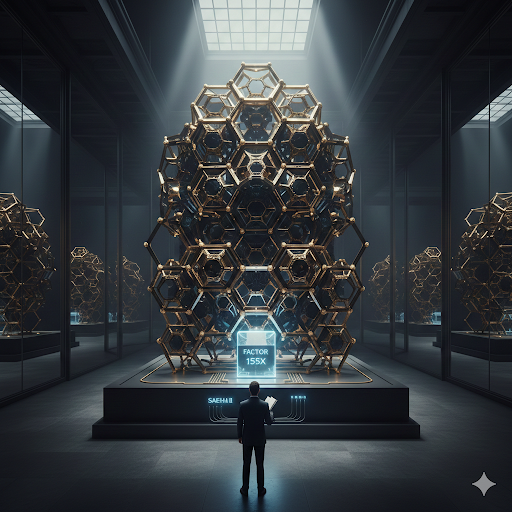

#

❄️ SAEHAI III (v11.5): SOBERANÍA TECNOLÓGICA CHILENA
## *Arquitectura de Almacenamiento Mecánico Criogénico para el Territorio Antártico*

---

### **Dirigida al Reino de Hielo, y a todas sus naciones**

**De mi consideración:**

Como investigador y desarrollador chileno, me dirijo a ustedes para presentar el proyecto **SAEHAI III (v11.5)**. Mi objetivo es  sea implementada y liderada prioritariamente por nuestro país en el **Territorio Chileno Antártico**.

---

### 🛡️ **El Desafío de la Soberanía**
Actualmente, nuestras bases dependen de la logística del diesel y de tecnologías de almacenamiento (litio) desarrolladas por potencias extranjeras que fallan en condiciones de frío extremo. SAEHAI propone una **Arquitectura de Soberanía Integral** basada en el **Silo Hades**, una unidad de almacenamiento mecánico de alto rendimiento que aprovecha las condiciones únicas del continente blanco para operar con máxima eficiencia.

---

###  **Ventajas del Liderazgo Nacional**

* **Tecnología de Vanguardia:** Uso de metamateriales de panal (**LSHM**) con una capacidad de **18.700 kWh**, superando en **155 veces** la densidad de sistemas convencionales.
* **Rendimiento Criogénico:** Optimizado para operar desde los -10 °C hasta temperaturas cercanas al **cero absoluto**. El sistema aumenta su eficiencia mecánica a medida que la temperatura desciende de forma extrema.
* **Transmisión de Alta Eficiencia:** Distribución inalámbrica en **220V DC** que aprovecha la **baja permitividad dieléctrica** del aire antártico para una entrega de energía con eficiencia del **98%**.
* **Independencia Logística:** Garantía de soporte vital mediante la **"Reserva Sagrada" de 1.500 kWh**, asegurando la supervivencia de la dotación sin suministros externos por periodos críticos.

---

###  **Propuesta Estratégica**
Mi intención es que el primer prototipo funcional de este sistema sea ántartico, consolidando nuestra presencia en la Antártica mediante el desarrollo de infraestructura crítica de propiedad nacional (bajo licencias de *Liberación Humana*).

Queda a disposición de los equipos técnicos la revisión de la documentación, fórmulas y simulaciones multifísicas publicadas en este repositorio para validar la viabilidad de este despliegue.

> *"La energía es soberanía, y el futuro de nuestra presencia en el hielo depende de nuestra independencia tecnológica."*

---
**Satoshi del Sol** *Arquitecto de Soberanía Integral* **Licencia:** MIT / GPLv3 con Cláusula de Liberación Humana
